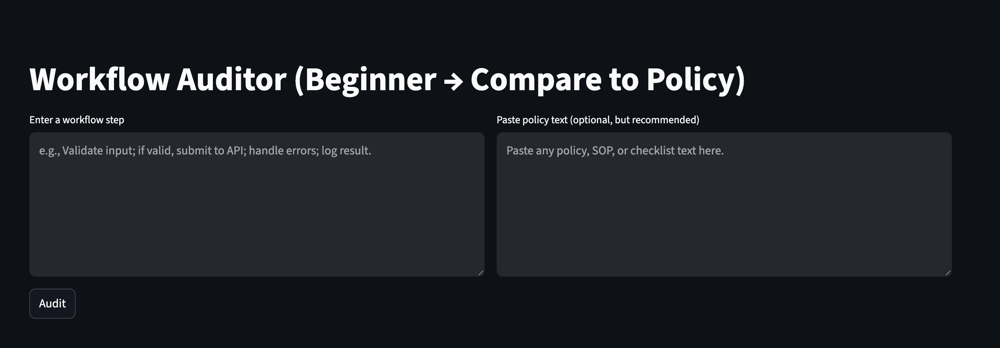

# RAG Workflow Auditor (Beginner Edition)

A simple AI tool that reviews a workflow step and compares it against policy text to provide quick audit feedback.

This project demonstrates building and running a small AI application using Python, Streamlit, and the OpenAI API.

---

## App Preview



---

## Tech Stack

- Python
- Streamlit
- OpenAI API
- GitHub Codespaces

---

## Run in GitHub Codespaces (Easiest Way)

1. Open this repository
2. Click **Code → Codespaces → Create Codespace**
3. Wait for environment to load
4. In the terminal run:

```bash
pip install -r requirements.txt
python -m streamlit run ui_app.py --server.address 0.0.0.0 --server.port 8501
