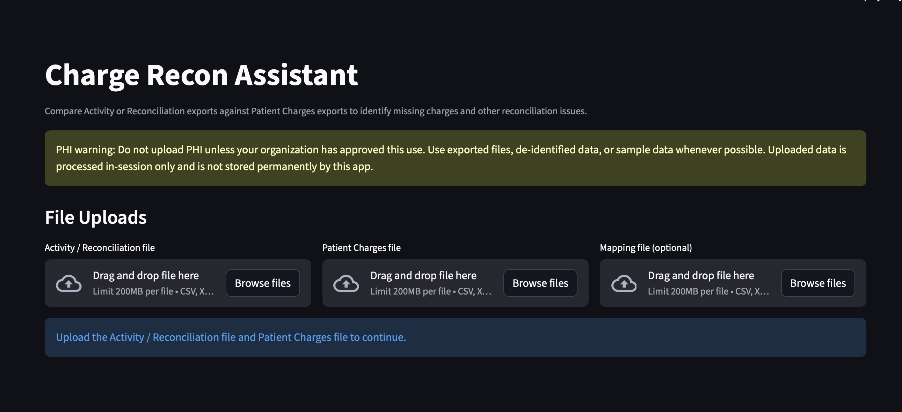
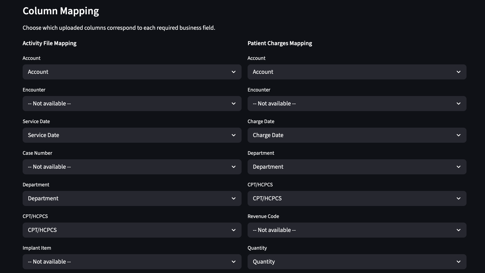
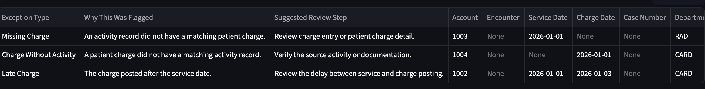
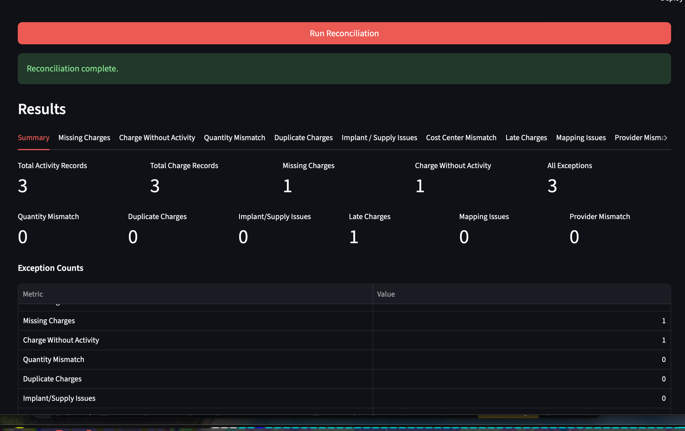

# Charge Recon Assistant

Charge Recon Assistant is a Streamlit application designed to help hospital departments and Revenue Integrity teams perform charge reconciliation by comparing activity/reconciliation exports against patient charge exports to identify missing charges and other reconciliation issues.

## Features
- Missing Charges detection
- Charge Without Activity
- Quantity Mismatch
- Duplicate Charges
- Implant / Supply Issues
- Cost Center Mismatch
- Late Charges
- Mapping Issues
- Provider Mismatch
- Exception Dashboard Summary
- Excel Exception Report Export

## How It Works
1. Upload Activity/Reconciliation file
2. Upload Patient Charges file
3. Upload optional Mapping file
4. App compares datasets and identifies reconciliation exceptions
5. Dashboard summarizes exception counts
6. Download Excel exception report

## Use Case
This tool is designed for:
- Charge Nurses
- Department Charge Entry Teams
- Revenue Integrity Analysts
- CDM Teams
- Revenue Cycle Managers
- Consultants
- Small Hospitals and Clinics

## Tech Stack
- Python
- Streamlit
- Pandas
- OpenPyXL
- GitHub

## Disclaimer
Do not upload PHI unless approved by your organization. Use de-identified data whenever possible.

## Screenshots

### Upload Files

### Dashboard

### Exception Tabs

### Summary Metrics

# Charge Recon Assistant

Live App:
https://charge-recon-assistant.streamlit.app

Charge Recon Assistant is a Streamlit web application designed to help hospital departments and Revenue Integrity teams perform charge reconciliation by comparing activity/reconciliation exports against patient charge exports to identify missing charges and other reconciliation issues.

## What This Tool Does

This tool compares:
- Activity / Reconciliation exports
- Patient Charge exports
- Optional Mapping files

It identifies:
- Missing Charges
- Charges Without Activity
- Quantity Mismatch
- Duplicate Charges
- Implant / Supply Issues
- Cost Center Mismatch
- Late Charges
- Mapping Issues
- Provider Mismatch

It then generates:
- Exception dashboard
- Exception tabs by type
- Excel exception report

  ## Use Case

This tool can be used by:
- Charge Nurses closing department charge entry
- Department charge reconciliation teams
- Revenue Integrity analysts
- CDM teams
- Revenue Cycle managers
- Consultants
- Small hospitals and clinics

The goal is to automate charge reconciliation and reduce manual auditing time while identifying missing charges and reconciliation errors.
